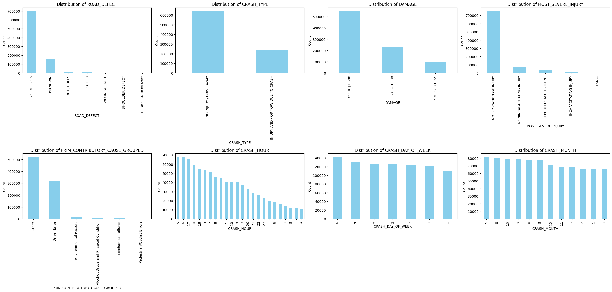
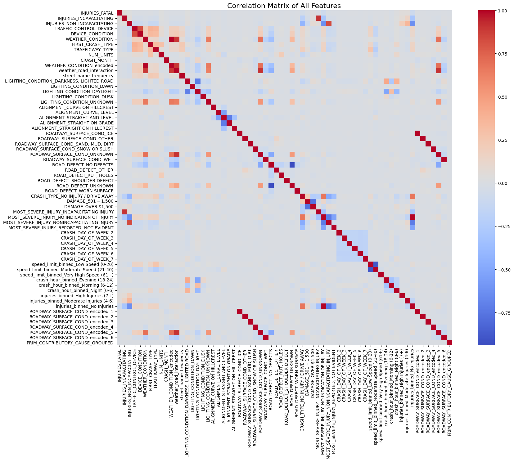
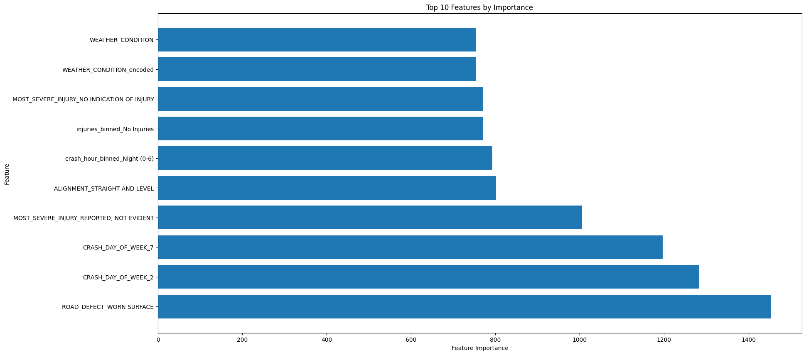
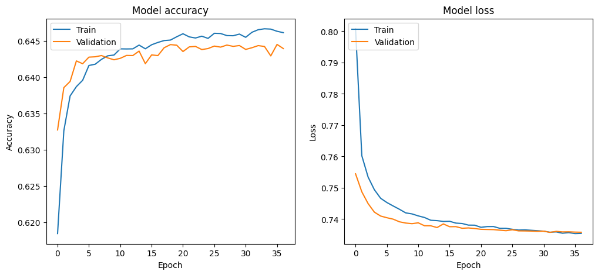
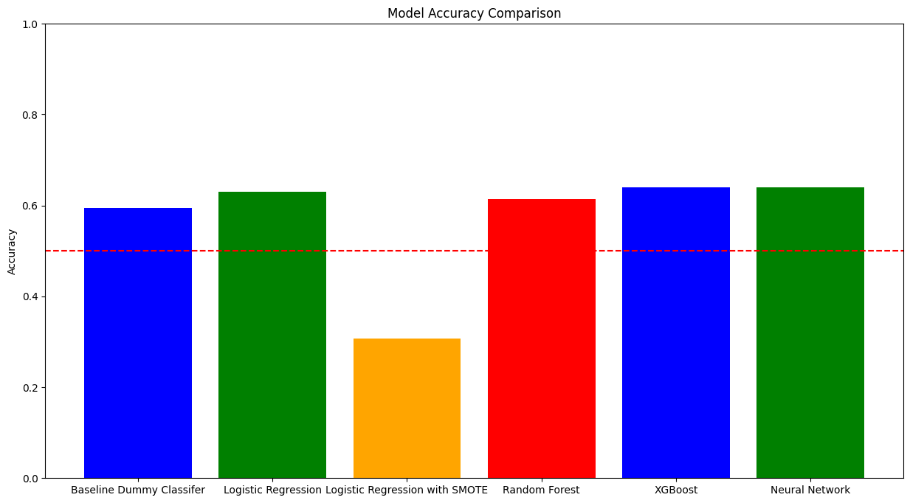

# **`CITY OF CHICAGO TRAFFIC CRASHES`**

This project attempts to identify the primary causes of accidents in the City of Chicago in order to help city planners, traffic safety boards, and policymakers take proactive measures to reduce accidents and improve road safety. The dataset used in this project, provided by the City of Chicago, includes detailed information about accidents, vehicles, and the people involved, offering a rich resource for understanding the underlying causes of crashes.

### **`Project Goals`**
The goal of this project is to build a model that predicts the **primary contributory cause** of a car accident based on factors such as road conditions, vehicle characteristics, and the people involved.

### **` Development Tools`**
- Python
- Pandas
- Numpy
- Matplotlib
- Seaborn
- scikit-Learn
- TensorFlow

## **`EXPLORATORY DATA ANALYSIS`**
### Selecting the Target Variable

- `PRIM_CONTRIBUTORY_CAUSE` was used as the target variable since it represents the main reason for each accident.
The 40 unique values of the `PRIM_CONTRIBUTORY_CAUSE` column were grouped into 5 broad categories.

#### Primary Contributory Cause Groupes

### **`Analsysis Visualizations`**

#### Distribution of Categorical Columns

#### Correlation Matrix for all Features

## **`Feature Engineering`**
- Continous variables were normalized and categorical variables were one-hot encoded. 
- Principal Componet Analysis(PCA) and SMOTE (Synthetic Minority Over-Sampling Technique) were used to reduce the dimensionality of the feature space and to address class imbalance respectively.

#### Top ten most important features

## **`MODELLING`**

The models used in this project are:

- Dummy Classifier
- Logistic Regression
- Random Forest
- XGBoost
- Neural Networks

#### ROC Curve for Neural Networks

### **`Comments on Model Performance`**

1. **Top Performer**: The **Neural Network** achieved the highest accuracy (0.6429) among all models and demonstrated strong performance in classifying key categories. However, it exhibits some signs of overfitting.

2. **Close Contender**: **XGBoost** closely follows with an accuracy of 0.6393, showcasing resilience against overfitting and robust classification capabilities.

3. **Next Best**: **Logistic Regression** (0.6303) displayed reasonable performance but lacked robustness across other classes.

4. **Random Forest** (0.6140) effectively identified **Pedestrian/Cyclist Errors** but struggled with minority classes.

5. **Logistic Regression (SMOTE)** performed poorly (0.3066), indicating that SMOTE did not effectively resolve class imbalance.

**Final Recommendation**

Based on the analysis, the **Neural Network** is recommended as the best model for predicting traffic crash causes, with **XGBoost** as a strong alternative. Future steps should include hyperparameter tuning to enhance model performance and mitigate overfitting, as well as employing model interpretability techniques to better understand decision-making processes.

### **`MODEL PERFORMANCE`**
#### Model Accuracy Comparisons

## **`Conclusion and Recommendations`**

### **`Conclusion`**
1. **Addressing the Problem with Predictive Models**:
   - The project’s objective was to **predict the primary causes of accidents** to help traffic planners and policymakers design targeted interventions. Both the **Neural Network** and **XGBoost models** effectively captured critical accident causes, such as **road conditions, time of day, and human behavior**, aligning with the stakeholders’ need for actionable insights.
   - **Neural Network** achieved the highest accuracy (**0.6429**) by learning complex, non-linear patterns from the data, helping identify nuanced relationships between variables. However, it exhibited **overfitting**, suggesting that further tuning is needed for consistent performance.
   - **XGBoost** followed closely with an accuracy of **0.6393**, providing robust performance without significant overfitting, making it a reliable alternative for practical applications.

2. **Insights on Contributory Causes**:
   - Key features identified by the models, such as **road defects** and **day of the week**, align with real-world safety concerns. This demonstrates that the models are not only predictive but also relevant to stakeholder needs.
   - These insights help city planners and safety boards focus on high-impact areas such as **infrastructure repair** (road defects) and **time-based interventions** (e.g., weekend traffic management).

3. **Handling Data Challenges**:
   - **Class Imbalance**: Despite efforts like **SMOTE**, models such as **Logistic Regression** struggled with minority classes, which reflects the complexity of accurately modeling rare accident causes.
   - The **Neural Network** and **XGBoost** outperformed other models by maintaining reasonable performance across different categories, demonstrating their ability to handle data imbalance better, though further improvement is still needed.

---

### **`Recommendations for Future Work`**
1. **Hyperparameter Tuning**: Further refine the **Neural Network** to address overfitting and unlock additional performance gains.
2. **Feature Engineering**: Explore new features, such as **weather and traffic congestion interactions**, to capture more nuanced relationships between accident causes.
3. **Continuous Learning**: As new data becomes available, retrain models periodically to maintain predictive relevance and adapt to changing traffic patterns.
